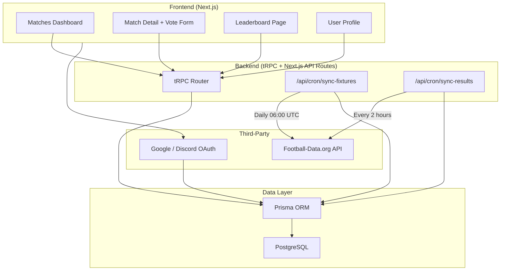

# FootyPredict — Technical Brief

## Stack Alignment (T3 Adaptation)

The original requirements proposed a separate Express/NestJS backend and JWT auth. This implementation uses the **Create T3 App** stack, which provides equivalent capabilities in a unified monolith:

| Requirement | Original Proposal | T3 Implementation |
|---|---|---|
| Frontend | React / Next.js + Tailwind | **Next.js 15 App Router** + Tailwind CSS v4 |
| Backend API | Express / NestJS | **tRPC** (end-to-end type-safe API) |
| Database | PostgreSQL | **PostgreSQL** via **Prisma ORM** |
| Auth | JWT / OAuth | **NextAuth.js v5** (Google + Discord OAuth) |
| Cron Jobs | External scheduler | **Vercel Cron** + Next.js API routes |

---

## 1. Database Schema Design

```prisma
// Core entities (see prisma/schema.prisma)

League ──< Match ──< Vote >── User
```

### Entity Summary

| Model | Purpose | Key Fields |
|---|---|---|
| **User** | Auth + gamification | `totalPoints`, `weeklyPoints` |
| **League** | Competition metadata | `externalId`, `name`, `logoUrl` |
| **Match** | Fixture data from API | `kickoffAt` (UTC), `status`, `result` |
| **Vote** | User prediction | `outcome` (HOME_WIN/DRAW/AWAY_WIN), `isCorrect`, `points` |

### Indexes

- `Match`: `kickoffAt`, `status`, `gameweek`, `leagueId`
- `Vote`: unique `(userId, matchId)` — prevents duplicate votes
- `Vote`: `matchId`, `userId` — fast aggregation queries
- `League`: unique `externalId` — idempotent API sync

### Leaderboard Strategy

Leaderboards are **computed from User points** rather than a separate table:
- **Global**: `ORDER BY totalPoints DESC`
- **Weekly**: `ORDER BY weeklyPoints DESC` (reset via cron on Mondays)

---

## 2. System Architecture & Data Flow



### Key Data Flows

**Vote Casting:**
1. User selects outcome (1/X/2) on match detail page
2. `vote.cast` mutation validates: auth, match status, 5-min lock window
3. `upsert` on `(userId, matchId)` — allows vote changes, prevents duplicates
4. After vote, `match.getVoteDistribution` reveals community stats

**Result Resolution:**
1. Cron fetches finished matches from Football API
2. Updates match status, scores, and derived `result`
3. Finds unresolved votes (`isCorrect IS NULL`)
4. Awards +10 points, increments `totalPoints` and `weeklyPoints`

**Timezone Handling:**
- All `kickoffAt` stored as UTC `DateTime` in PostgreSQL
- Frontend uses `Intl.DateTimeFormat` with user's local timezone

---

## 3. Workload & Task Breakdown

### Epic 1: Project Foundation ✅
- [x] Initialize T3 app (Next.js, tRPC, Prisma, NextAuth, Tailwind)
- [x] Configure PostgreSQL database
- [x] Set up environment variables

### Epic 2: Database & Schema ✅
- [x] Design Prisma schema (User, League, Match, Vote)
- [x] Add enums (MatchStatus, VoteOutcome)
- [x] Add performance indexes and unique constraints

### Epic 3: Authentication ✅
- [x] Configure NextAuth with Google + Discord OAuth
- [x] Custom sign-in page
- [x] Session propagation to tRPC context

### Epic 4: Match Management & API Sync ✅
- [x] Football-Data.org API client
- [x] Fixture sync service (daily cron)
- [x] Result resolution service (2-hour cron)
- [x] Handle postponed/cancelled match statuses

### Epic 5: Voting Engine ✅
- [x] Vote cast/change mutation with 5-min lock
- [x] Duplicate vote prevention (unique constraint + upsert)
- [x] Community vote distribution (gated behind user vote)

### Epic 6: Gamification & Leaderboard ✅
- [x] Points calculation on result resolution (+10 correct)
- [x] Global and weekly leaderboard queries
- [x] User profile with accuracy stats

### Epic 7: Frontend UI ✅
- [x] Matches dashboard (grouped by gameweek)
- [x] Match detail page with voting
- [x] Leaderboard page
- [x] User profile page
- [x] Mobile-responsive Tailwind design

### Epic 8: Production Readiness (Next Steps)
- [ ] Configure OAuth credentials (Google/Discord)
- [ ] Obtain Football-Data.org API key
- [ ] Deploy to Vercel with cron jobs
- [ ] Add weekly points reset cron (Monday 00:00 UTC)
- [ ] Add error monitoring (Sentry)
- [ ] Add E2E tests (Playwright)

---

## 4. Complexity & Risk Assessment

| Risk | Severity | Mitigation |
|---|---|---|
| **Race condition at vote lock** | High | Server-side time check in mutation; DB unique constraint as safety net |
| **API rate limiting** | Medium | Daily fixture sync (not per-request); cache match data in DB; batch result checks every 2h |
| **Match postponements** | Medium | API sync updates `status` and `kickoffAt`; postponed matches remain votable |
| **Duplicate point awards** | High | Only process votes where `isCorrect IS NULL`; idempotent result resolution |
| **Timezone confusion** | Low | Store UTC only; format on client with `Intl.DateTimeFormat` |
| **OAuth provider downtime** | Low | Multiple providers (Google + Discord); graceful sign-in page |

---

## 5. Project Structure

```
SavingForBonding/
├── prisma/
│   └── schema.prisma          # Database schema
├── src/
│   ├── app/
│   │   ├── _components/       # Shared UI components
│   │   ├── api/
│   │   │   ├── auth/            # NextAuth handlers
│   │   │   ├── cron/            # Cron job endpoints
│   │   │   └── trpc/            # tRPC handler
│   │   ├── auth/signin/         # Custom sign-in page
│   │   ├── leaderboard/         # Leaderboard page
│   │   ├── matches/[id]/        # Match detail + voting
│   │   ├── profile/             # User stats
│   │   └── page.tsx             # Matches dashboard
│   ├── lib/
│   │   └── match.ts             # Vote lock, result derivation utils
│   ├── server/
│   │   ├── api/routers/         # tRPC routers (match, vote, leaderboard)
│   │   ├── auth/                # NextAuth config
│   │   └── services/            # Football API + sync logic
│   └── env.js                   # Environment validation
├── vercel.json                  # Cron job schedules
└── TECHNICAL_BRIEF.md           # This document
```

### Setup Commands

```bash
# 1. Start PostgreSQL (Docker)
./start-database.sh

# 2. Push database schema
npm run db:push

# 3. Configure environment (.env)
#    - AUTH_SECRET (npx auth secret)
#    - AUTH_GOOGLE_ID / AUTH_GOOGLE_SECRET
#    - FOOTBALL_DATA_API_KEY
#    - CRON_SECRET

# 4. Start development server
npm run dev

# 5. Sync fixtures manually (after API key is set)
curl -H "Authorization: Bearer $CRON_SECRET" \
  http://localhost:3000/api/cron/sync-fixtures
```

---

## API Reference (tRPC)

| Procedure | Auth | Description |
|---|---|---|
| `match.listUpcoming` | Public | Upcoming matches sorted by gameweek |
| `match.getById` | Public | Match detail + user vote + lock status |
| `match.getVoteDistribution` | Protected | Community vote % (requires user vote) |
| `vote.cast` | Protected | Cast or change prediction |
| `vote.getMyVotes` | Protected | User's prediction history |
| `vote.getMyStats` | Protected | Accuracy, points summary |
| `leaderboard.global` | Public | All-time rankings |
| `leaderboard.weekly` | Public | Weekly rankings |
