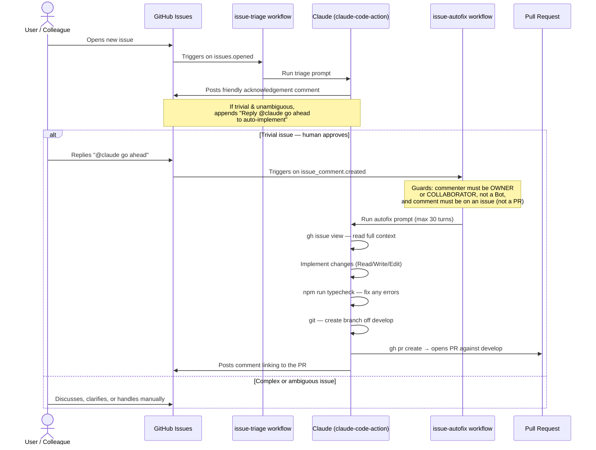

# Claude-Assisted Issue Workflow

This document explains how Claude automatically triages new GitHub issues and, for small changes, implements them as pull requests — all without a developer having to touch the keyboard.

---

## How It Works (Overview)

Two GitHub Actions workflows run in sequence:

1. **issue-triage** — fires the moment a new issue is opened. Claude reads it and posts a friendly, plain-English comment acknowledging the request. If the request is small and clear enough, Claude adds a prompt inviting a human to trigger implementation.

2. **issue-autofix** — fires when an authorised person replies `@claude go ahead` on an issue. Claude reads the full issue thread, writes the code, typechecks it, and opens a pull request against `develop`.



---

## Setup Requirements

### 1. Authenticate Claude with your GitHub repository

The workflows use `anthropics/claude-code-action@v1`, which authenticates via a **Claude Code OAuth token** — the same credential your local `claude` CLI uses.

**Steps:**

1. Generate a Claude Code OAuth token:
   - Run `claude setup-token` in your terminal. It will print a token you can copy.

2. Add the token as a repository secret:
   - Go to **GitHub → Your repo → Settings → Secrets and variables → Actions → New repository secret**
   - Name: `CLAUDE_CODE_OAUTH_TOKEN`
   - Value: the OAuth token

> **Note:** There is no separate "Claude GitHub App" to install for this setup. The `claude-code-action` runs Claude as a CLI binary inside the Actions runner — it only needs the OAuth token, not an app installation.

### 2. Add the workflow files

Commit both files to `.github/workflows/`:

| File | Purpose |
|------|---------|
| `.github/workflows/issue-triage.yml` | Triage on `issues: [opened]` |
| `.github/workflows/issue-autofix.yml` | Autofix on `issue_comment: [created]` |

No other configuration is needed. The workflows use GitHub's built-in `GITHUB_TOKEN` for repo access (via the `permissions:` block in each file) and the Claude OAuth token only for authenticating with Anthropic's API.

### 3. Issue templates (optional but recommended)

The issue templates in `.github/ISSUE_TEMPLATE/` guide users to provide structured input (what went wrong, expected behaviour, reproduction steps). Better input → better triage → fewer clarifying questions needed.

---

## Workflow Details

### issue-triage.yml

| Setting | Value |
|---------|-------|
| Trigger | `issues: [opened]` |
| Permissions | `contents: read`, `issues: write`, `id-token: write` |
| Claude tools | `gh issue comment:*`, `gh issue view:*` |

Claude is given the issue title, body, and author. It posts a comment that:
- Restates the request in plain language (no technical jargon)
- Asks clarifying questions only about the *desired outcome*, not the implementation
- Privately classifies the issue as `trivial`, `simple`, or `complex`
- Appends `Reply @claude go ahead to auto-implement` **only** when the issue is trivial and fully clear

This triage step acts as a natural gate: complex or ambiguous work stays in the human queue.

### issue-autofix.yml

| Setting | Value |
|---------|-------|
| Trigger | `issue_comment: [created]` |
| Guard conditions | Comment contains `@claude go ahead`; commenter is not a Bot; comment is on an issue (not a PR); commenter's `author_association` is `OWNER` or `COLLABORATOR` |
| Permissions | `contents: write`, `issues: write`, `pull-requests: write`, `id-token: write` |
| Checkout branch | `develop` |
| PR target | `develop` |
| Max turns | 30 |
| Claude tools | `Read`, `Write`, `Edit`, `gh issue view:*`, `gh issue comment:*`, `gh pr create:*`, `git:*`, `npm run typecheck:*` |
| Env secrets | `DATABASE_URL`, `AUTH_SECRET`, `ADMIN_PASSWORD`, `TURSO_DATABASE_URL`, `TURSO_API_KEY` — all explicitly set to `""` |

Claude's implementation loop:
1. Reads the full issue thread (`gh issue view --comments`)
2. Implements the change following project conventions (TypeScript, Next.js App Router, tRPC, Tailwind v4)
3. Runs `npm run typecheck` and fixes any errors
4. Creates a new branch off `develop`
5. Opens a PR against `develop` with a clear title, summary, and `Closes #<issue-number>` to auto-close

---

## Security Design

Several deliberate constraints limit what Claude can do:

**Tool allowlist** — Claude can only call specific commands. It cannot run arbitrary shell commands, access the internet, or touch the database. If a task requires a tool outside the list, it fails safely.

**Author association gate** — only `OWNER` and `COLLABORATOR` can trigger autofix. External contributors cannot self-approve their own issues. The `Bot` type exclusion prevents recursive triggering (Claude's own triage comment cannot kick off autofix).

**No comment on PRs** — the `github.event.issue.pull_request == null` check ensures the autofix only fires on issues, not PR review comments.

**Secrets explicitly cleared** — even though the runner might inherit secrets from the environment, the workflow explicitly sets all database and auth secrets to empty strings. Claude cannot accidentally read or log production credentials.

**Branch isolation** — all changes go to a new branch off `develop`, never directly to `main` or `develop`. A human must review and merge the PR.

---

## Lessons Learned

### What works well

- **Triage as a gate.** Having a separate triage step before autofix means Claude only self-assigns work it can genuinely handle. Complex issues naturally stay in the human queue without any extra logic.

- **Plain-English comments.** Prompting Claude to avoid code and file paths in its triage comment makes it accessible to non-developers filing issues — the target audience for an app shared among friends.

- **Tool allowlist is worth the friction.** Restricting tools to a named list feels restrictive, but it prevents subtle mistakes (e.g., Claude running `npm install` and modifying `package-lock.json`, or accidentally calling a seeding script).

- **Caching the Claude binary.** The `actions/cache` step on `~/.local` avoids re-downloading the Claude CLI on every run, which meaningfully speeds up the workflow.

### Gotchas and pitfalls

- **`author_association` vs. `user.type`.** The triage workflow uses `github.event.comment.user.type != 'Bot'` to exclude bots, and `author_association` to gatekeep autofix. These are different fields — `user.type` catches GitHub Apps and Actions bots; `author_association` (`OWNER`, `COLLABORATOR`, `MEMBER`, etc.) reflects the commenter's repo relationship. Both checks are needed.

- **The `id-token: write` permission is required** for OIDC-based authentication inside `claude-code-action`. Without it, the action cannot exchange credentials and will fail silently or with a confusing error.

- **Autofix fires on *any* comment that matches.** If an owner accidentally comments `@claude go ahead` on a complex issue, autofix will attempt it. The triage prompt deliberately withholds the trigger phrase from complex issues, but it's not a hard block — anyone with the right association can type it manually.

- **`npm run typecheck` is the only quality gate.** The project has no test suite, so Claude's only automated feedback loop is the TypeScript compiler. This works for most UI/logic changes but won't catch runtime behaviour regressions.

- **Secrets must be *explicitly* unset.** GitHub Actions does not automatically strip secrets from the environment. Setting them to `""` in the `env:` block of the autofix job is the only reliable way to ensure Claude cannot access them.

- **`base_branch: develop` in the action config** tells `claude-code-action` which branch to diff against when creating a PR. Without this, it may default to `main` and the PR will include unrelated commits from `develop`.

---

## File Reference

```
.github/
├── workflows/
│   ├── issue-triage.yml      # Triage new issues with Claude
│   └── issue-autofix.yml     # Auto-implement trivial issues
└── ISSUE_TEMPLATE/
    ├── bug-report.yml        # Structured bug report form
    └── feature-request.yml   # Structured feature request form
```
